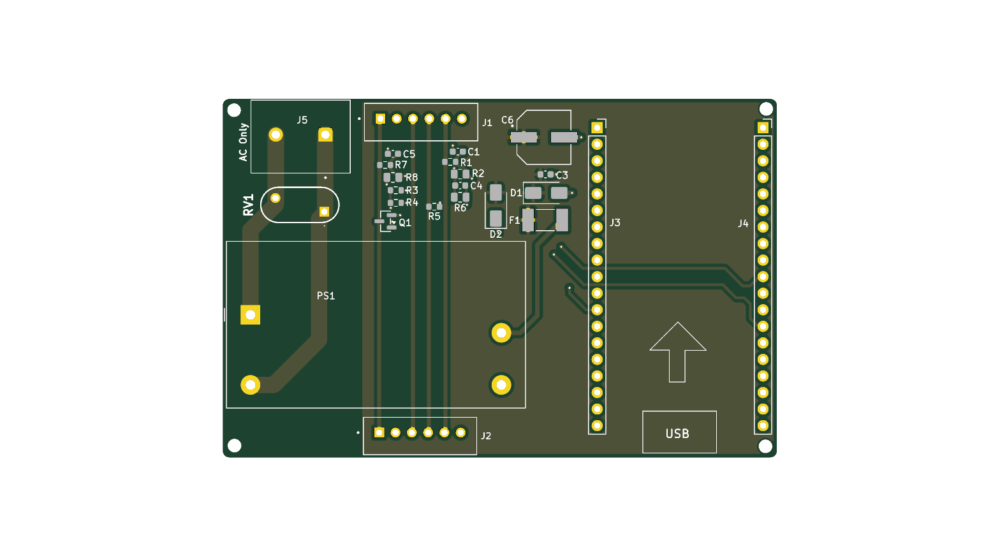

# Breezy

ESP32 smart-home component for my air conditioner, physically sitting between the HVAC controller and its LCD control panel.

The kit here is a **USP 5010** — controller plus LCD panel (the panel is
marked USP5010BE). If that is what you have, the protocol docs and the
ESPHome components in this repo should work as-is.

Smart-home capability achieved with ESPHome (flashed via USB, OTA available).  
Reads are done by intercepting SPI updates from the AC to the panel.  
Writes are done by emulating IR remote commands.

## In this repo
1. [pcb](pcb/): Board schematics, JLCPCB-ready
2. [esphome/components](esphome/components/): Custom ESPHome components ([example config](esphome/breezy_v4.yaml))
3. [case](case/): scad files for a small case/box for the pcb
4. [docs](docs/): the protocol specs — [the bus](docs/PROTOCOL_BUS.md) and
   [the IR command language](docs/PROTOCOL_IR.md) — plus the working notes
   behind them, and [some photos](docs/photos.md).

## Wiring

Physical wiring:
1. JST 6-wire cable (only 5 actual wires) to AC unit
2. JST 6-wire cable (only 5 actual wires) to LCD panel
3. 220v in (L/N screw terminals) for powering the ESP32 (5v from SPI is weak)

JST wiring is 5v (5v+, gnd, SPI data, SPI clock, IR)

The ESP32 itself is a socketed 38-pin ESP32-WROOM-32 DevKitC-style module
(2×19 headers) — not included on the PCB, plug in your own.

## The protocol, briefly

### Read
The HVAC and its panel talk over a clocked two-wire bus, ~33 ms per cycle.
There are exactly two frames on it:

- a **36-bit LCD status poll** — the controller opens it and goes quiet, and
  the panel answers *inside the same frame* by pulling bits low (the line is
  wired-AND). I don't decode what the panel says; I have no use for it.
- a **76-bit controller status** — the complete unit state, and the one I
  read: power, mode, set temperature, room temperature, fan speed, and
  whether the compressor is actually running right now.

Every bit of the controller status is located and its encoding known, so a
frame can be generated from scratch and checked against the two checksums it
carries. Two flag bits are still unexplained — I know where they are and
when they fire, just not what they mean; one is probably the panel's
backlight. Full field map in [`docs/PROTOCOL_BUS.md`](docs/PROTOCOL_BUS.md).

### Write

The controller is receiving IR commands from a remote via the LCD panel.
The panel holds an IR receiver, demodulates the output and sends the binary on a dedicated wire to the controller, which we can both intercept and send our own.

The IR protocol is reverse engineered completely: any mode, temperature and
fan speed can be composed from scratch, including power-on, which carries the
target state inside the toggle so the unit wakes straight into it. Full spec
in [`docs/PROTOCOL_IR.md`](docs/PROTOCOL_IR.md).

Two things about it are worth knowing before you read anything else:

- **The symbol spelling is the code.** Three of the four pulse shapes mean
  "1", so the same bits can be spelled several ways — and the unit treats
  different spellings as *different commands*.  
  When encoding / decoding, take care to note the length of each part of the pulse (the "on" and the "off" afterwards).
- **24 °C and 25 °C share a temperature byte** and are told apart only by the
  frame being one bit shorter. That one confused me for a while.

## Short version history

Bus pirate worked out of the box for reading, and Arduino R4 bitbanging was enough for writing.  
When moving to dedicated ESP32+PCB, I had to iterate a bit.  
My main pain points were:
1. HVAC wiring didn't contain enough current to power the ESP32, so I needed an external supply and converter
2. HVAC wiring was 5v, and ESP32 operates on 3.3v, so couldn't connect them directly and had to step voltage up/down

- **v1** — BSS138 level shifters with 10K pull-ups. Too slow for the bus; edges rounded off.
- **v2** — TXS0104 shifter, and the board's 5V tied to the panel's,
  either drawing too much current from the panel for it to work,
  or polluting the data with noise from the converter.
- **v3** — 5V properly isolated, but the TXS0104 turned out to be the wrong tool, occasionally misreading the ESP32 as low-driving and pushing that low to the HVAC side, making the panel get garbage data and display nonsense (−9 °C) whenever the ESP32 was powered. It also couldn't read
  and write IR on the same line.
- **v4** — replaced the TXS0104 with plain resistors (high-impedance 100K/180K
  divider taps for reading), and split IR across two ESP32 pins: one read-only
  via a tap, one write-only via an open-collector transistor that pulls the line
  low. For the HVAC components, the board feels like a plain cable.

A recurring pattern was that ESP32 was not a reliable narrator when it had other duties.  
I had several mysteries caused by the ESP32 doing something else (IR transmission, verbose logging) that occupied it enough so it missed bits, generating corrupt or odd frames, both making understanding current state much harder.   
If the measurement is weird, use a dedicated device (another esp32, BusPirate etc)

## ⚠ Mains voltage

This board is powered directly from **220 V AC** through screw terminals on the
PCB. It is a hobby project, not a certified appliance — it has had no safety
testing or approval of any kind. In particular, note it has **no mains-side
fuse**: F1 is a resettable PTC on the 5 V output, and the varistor sits
unfused across L–N. If you build one, you are responsible for
knowing how to work safely with mains, for enclosing it properly, and for
whatever your local regulations require. Don't work on it energised.

## License

MIT — see `LICENSE`.
