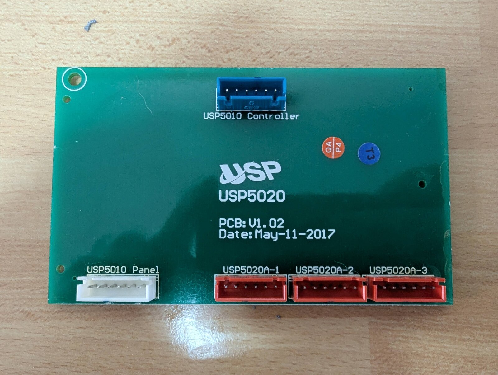
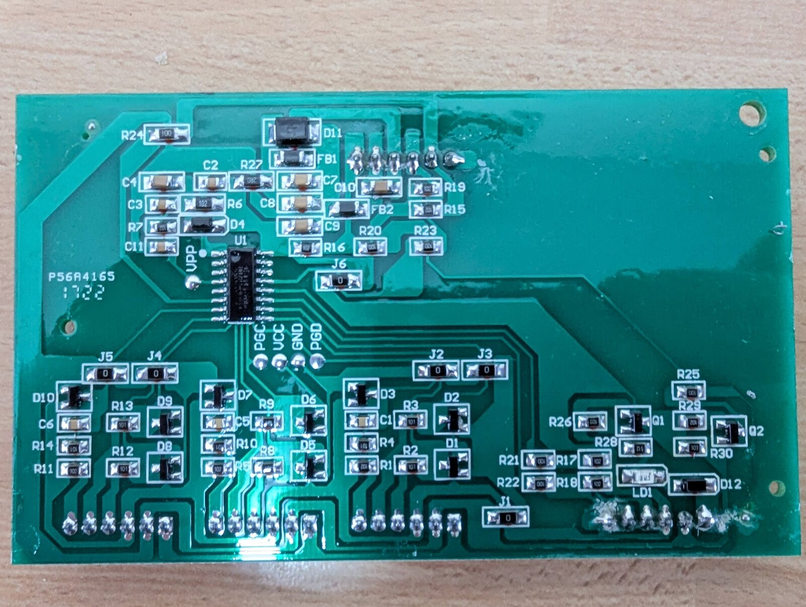
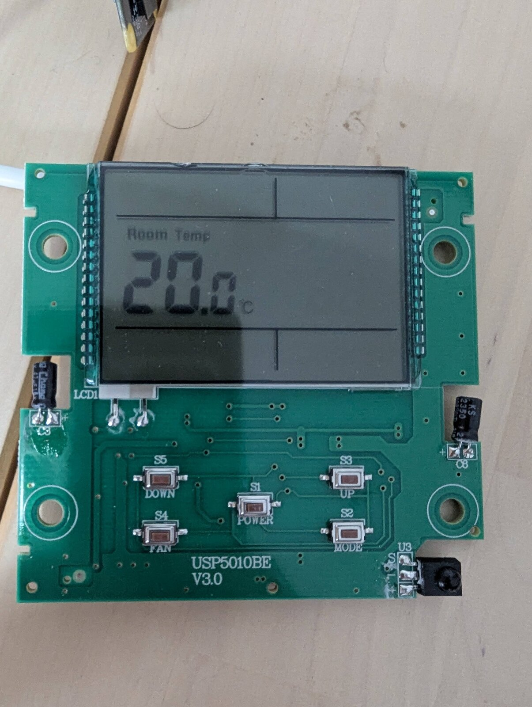
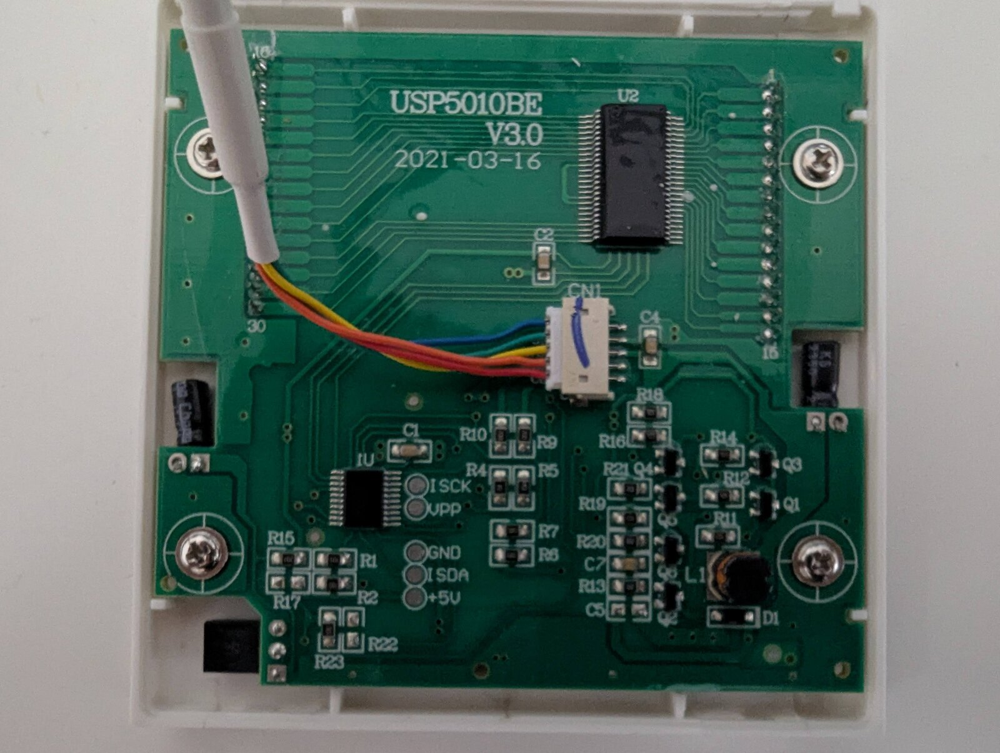
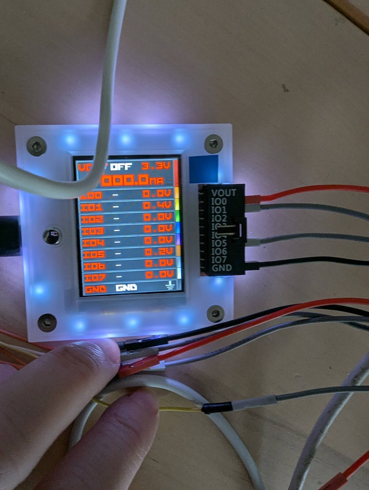
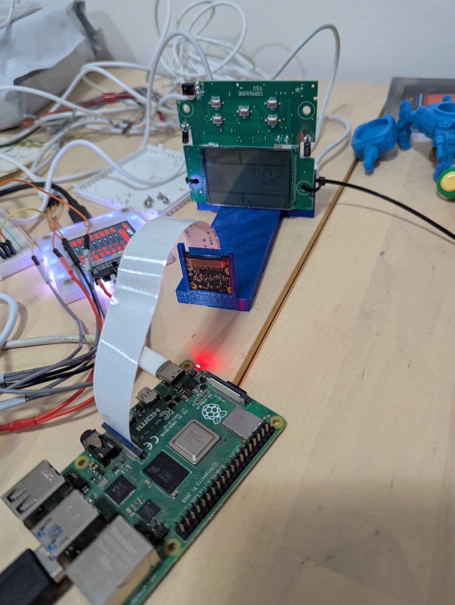
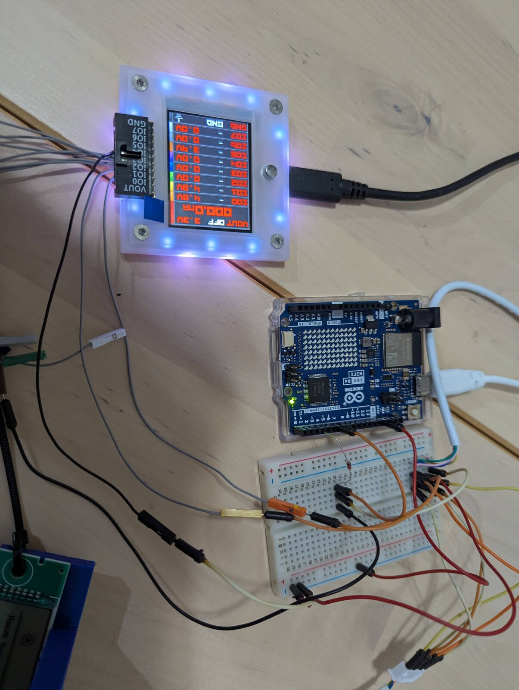
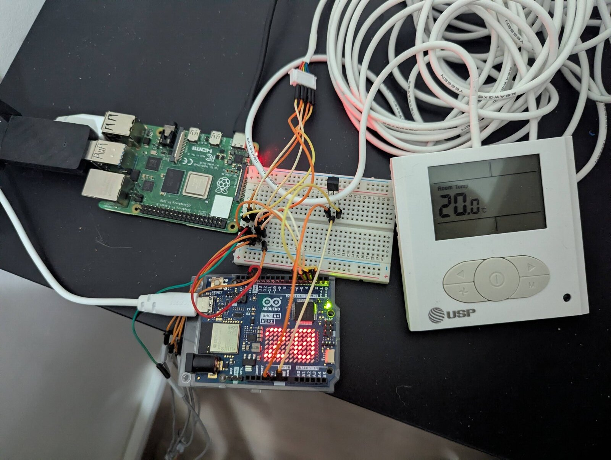
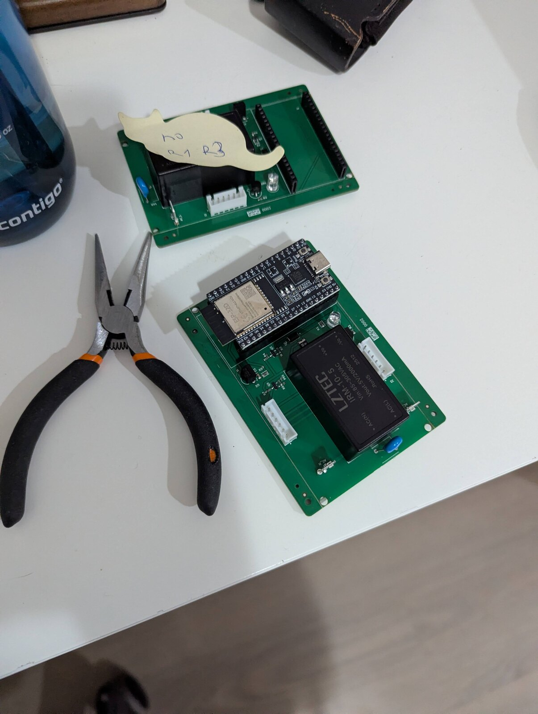

# Photos

Some photos I made

## Looking at some boards

### USP5020 hub board
  
This is a side-board that allows "splitting" the lcd-port cable into one lcd-port and more "dumb" terminals that only include a status led and IR receiver.  
I was hoping that the splitter would allow me to connect my gizmo in parallel to the LCD screen and not between, but no, because the pins on the red JSTs don't map 1-1 to the blue/white pins.  
I now believe that there's a chip inside the splitter that extracts "led status" from the SPI messages, and passes IR messages upstream as is. In any case, I can't use this splitter for anything useful.

  
From the other end.  
Note the 4 programming pads (PGC, VCC, GND, PGD). They're dead, probably cut after initial flashing, but it made me hopeful that the actual communication protocol also has a data/clock pair that I can tap

### Panel front, outside the plastic case
  
Not very interesting. You can see the IR receiver on the bottom right. The PCB identifier gave me nothing when searching it online.

### Panel board in its housing with the harness attached
  
The backside of the LCD panel. None of the chips were recognizable, but using a multimeter on the pads (ISCK, VPP, GND, ISDA, +5V) and the different JST connectors hinted me on which color wire is which, and that one of the protocol's sides is ISP-shaped. 

## Buspirate and Arduino

### Bus Pirate probing the bus
  
This was after I cut the AC controller-panel cable and connected it to the buspirate directly. You can see some wires have some voltage, which means something is working.  
Fun fact: I initially connected the wrong wires to gnd/5v+, meaning that about 2 days of sniffing were wasted on bad results.

### Camera + Bus Pirate correlation rig
  
As skunkworks as I got:
1. rpi running some Linux (Debian/Arch, don't remember), connected to my wifi and SSH-accessible
2. Buspirate  
   1. connected to breadboard (cut on the left), and through it to the HVAC controller
   2. connected to the rpi via USB, operating in SUMP (transmitting relatively-raw data over USB to be read by sigrok)
3. rpicam  
  1. connected to rpi via the ribbon cable
  2. mounted on my 3d-printed camera-lcd-holder
  3. pointing at the lcd panel, so it sees the mode, compressor indicator, fan, temps
4. lcd panel  
   1. removed from the plastic case, and instead mounted on my 3d-printed holder
   2. held in place by zip-ties which were a bit fiddly, but as long as a 1-meter no-fly-zone around the table was maintained, worked.
5. breadboard  
   Allows a 3-way splitter, connecting the HVAC controller to both lcd panel and buspirate.  
   This allows me to both read the SPI data via the buspirate, and display it on the lcd panel to be captured by the camera

The code side of this was a shell/python monstrosity on the rpi that does the following:
1. Grabs photo via the rpicam of the LCD panel
2. Reads some traffic via buspirate
3. Grabs another photo via the rpicam
4. Uses some poor-mans-computer-vision Python to extract digits / modes from the panel, preferring marking things as unknown over guessing
5. Builds a "package" directory with the before,after, data capture, and a "manifest" including the interpreted data, also noting if the extracted lcd data differs before/after (making it "dirty" as we can't rely on the capture to compare LCD and wire data)

This script was used to extract a lot of packages and then employ LLM (I think Opus 4.x) to compare them and reverse engineer the wire protocol.

### Arduino R4 and Bus Pirate
  
This was the write-decoding part.  
The Arduino is connected in 3 wires to the rpi:
1. gnd
2. IR in (to learn IR commands from the remote)
3. IR out (to try imitating them)

The breadboard is still connected to the LCD panel and the Bus Pirate, in addition to the HVAC controller and the Arduino.
This time, I had the rpi record the before-state, IR command, after-state from the Bus Pirate, then try and send the same command from the Arduino to see if I can get the same effect.  
Once I managed that, I reverse-engineered the IR commands to try and compose new ones, sent them via the Arduino, and tested via the Bus Pirate whether they had the wanted effect

## Working prototypes

### Working Arduino setup
  
The Bus Pirate is now gone. The Arduino is now doing reading data and writing IR commands.  
It uses some custom code to connect to homeassistant over MQTT (mosquitto) and expose a climate-control entity, which worked.  
I used an Arduino R4 I found because it has wifi, and unlike ESP32 boards (of which I had a bunch), it's ok with 5v.  
Because it's an R4, it comes with the LED matrix which I had displaying the current temperature for fun.  
This setup worked for a couple of weeks until I gave up on maintaining the delicate cabling and moved to PCB design.

## PCBs!

### First custom boards with rework note
  
These are the v1 boards I got. They didn't work at all, and on one of them I tried solving things by breaking some components so I marked it.  
I might upload more.
